# ai
ai 

```mermaid
graph TD
    AI[Artificial Intelligence]

    AI --> ML[Machine Learning]
    AI --> DL[Deep Learning]
    AI --> NLP[NLP]
    AI --> CV[Computer Vision]
    AI --> Robotics[Robotics]
    AI --> Expert[Expert Systems]
    AI --> RS[Recommender Systems]

    %% Machine Learning
    ML --> Sup[Supervised]
    ML --> Unsup[Unsupervised]
    ML --> RL[Reinforcement]
    ML --> Semi[Semi-Supervised]

    %% Deep Learning
    DL --> ANN[ANN]
    DL --> CNN[CNN]
    DL --> RNN[RNN]
    DL --> GAN[GANs]
    DL --> Transformer[Transformers]

    %% NLP
    NLP --> Gen[Text Gen]
    NLP --> SA[Sentiment]
    NLP --> MT[Translation]
    NLP --> QA[Q&A]
    NLP --> Bot[Chatbots]

    %% Computer Vision
    CV --> IR[Img Recog]
    CV --> OD[Obj Detect]
    CV --> Seg[Segmentation]
    CV --> VA[Video Analysis]

    %% Robotics
    Robotics --> Plan[Path Plan]
    Robotics --> Ctrl[Motion Ctrl]
    Robotics --> SLAM[SLAM]

    %% Expert Systems
    Expert --> Rule[Rule-Based]
    Expert --> KB[Knowledge Base]

    %% Recommender Systems
    RS --> Content[Content-Based]
    RS --> Collab[Collaborative]
    RS --> Hybrid[Hybrid]
```

- **AI Definitions and Interpretations:**
  - AI involves teaching machines to learn, think, and act like humans.
  - It includes image recognition, natural language processing (NLP), and speech comprehension.

- **AI as Augmentation, Not Replacement:**
  - AI is often viewed as a tool to augment human abilities rather than replace them.
  - The key to AI is empowering machines to think and learn independently.

- **Technical Perspective of AI:**
  - AI applies algorithms to solve complex problems intelligently.
  - This intelligence could mimic human thinking or use computational approaches to analyze data and reveal hidden patterns.

- **Automation through AI:**
  - AI automates tasks with minimal to no human intervention.
  - It is powered by complex, layered algorithms that process incoming data.

- **AI and Machine Learning:**
  - AI technologies enable systems to learn from data, identify patterns, and apply this learning to new situations.
  - Machine learning (ML), a subset of AI, uses mathematical algorithms to find patterns in structured and unstructured data.
  - Unlike traditional coding, machine learning allows machines to discover patterns autonomously without human intervention.

- **AI as a Data-Driven Tool:**
  - AI extracts knowledge from data and applies it to solve problems or make decisions.
  - It is a powerful tool for automating tasks and discovering insights that humans might not immediately notice.

### AI 101
* tree search
* expert systems (if-else) 
* classification - op/p is class
* clustering - related clusters
* regression - numerical prediction 
* supervised
* unsupervised
* reinforcement learning
